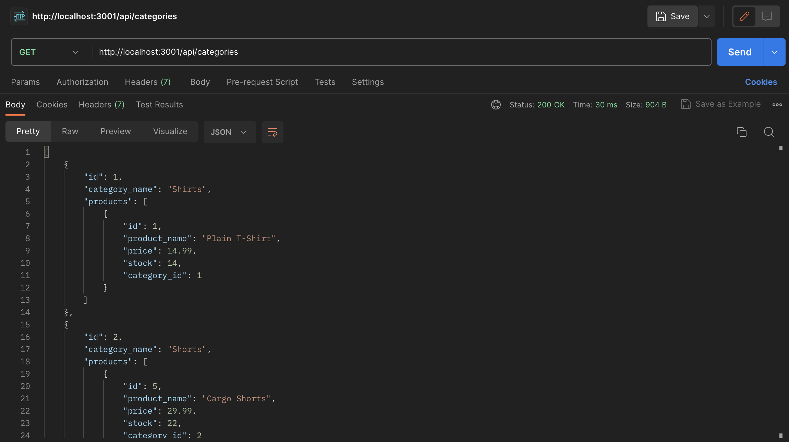

# E-commerce_Backend

## Description

This application serves as the backend system for an e-commerce platform, providing the necessary functionality to manage products, categories, and tags.  
In today's world, e-commerce plays a significant role in online activities, serving as a primary method of shopping for many users. A well-organized backend system is crucial for supporting a pleasant user experience and ensuring smooth frontend operations.  
This application focuses on two major ways of searching for products: by categories and tags. Products are organized into different categories, allowing users to browse and filter items based on their preferences. Additionally, tags provide another layer of classification, enabling users to search for products based on specific characteristics or attributes.  
The E-Commerce Backend application is built with Node.js and utilizes a MySQL database to store product, category, and tag data. It offers a range of API endpoints to perform CRUD operations (Create, Read, Update, Delete) for managing products, categories, and tags. 

## Table of Contents

- [Installation](#installation)
- [Usage](#usage)
- [Contributing](#contributing)
- [Tests](#tests)
- [License](#license)
- [Questions](#questions)

## Installation

1. Clone or download the repository to your device.
2. Install node.js v18.15.0
3. Install the necessary package by typing npm i in the command line
4. Setup environment veriables by create a .env file and provide following: DB_USER="" DB_PW="" DB_NAME=ecommerce_db. Replace the empty quotes ("") with the appropriate values for your MySQL database configuration.
5. Create database by runnning the lines in db/schema.sql in MySQL
6. Setup mock database by running npm run seed
7. Using API development platform such as Postman, Insomnia, etc... or curl to interact with the application's API endpoints.

## Usage

1. Ensure that the provided API endpoints, such as http://localhost:3001/api/categories/, are correct and match the routes defined in your application. Double-check the base URL and ensure that you include the necessary route paths for different API operations.
2. When making GET requests by ID, PUT requests, and DELETE requests, make sure to provide a valid ID parameter in the URL.
3. Ensure to provide the correct keys when making PUT and POST requests.

Please find attached video demonstrating the installation of our application. 
https://drive.google.com/file/d/1KMP9E4wxp6sIXdzY1teaNSdA8crK4dR4/view
Please find attached demo video showcasing the functionality of our application. 
https://drive.google.com/file/d/1lJCiDGlvhkoJbtR09zXsWwekH3VbqCLi/view  

## License

This project is licensed under the MIT License - see the link for detail
https://opensource.org/license/mit/

## Credits

OpenAI 
mysql2 at https://www.npmjs.com/package/mysql2 
inquirer at https://www.npmjs.com/package/inquirer#separator 
License Badge created by shields.io 
License links provide by opensource.org 

## Tests

Currently, there is no test available.

- My GitHub: jenryt
- My email: bicodeture@gmail.com
